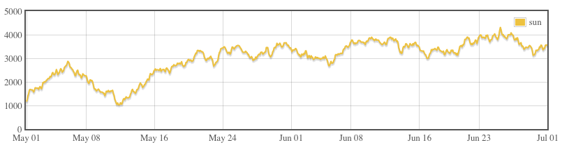

# About 

Javascript library for loading [rrd4j](https://github.com/rrd4j/rrd4j) files

# Installation

### NPM

	npm install rrd4j-js

# Usage

	var RRDFile = require('rrd4j-js')
	var data = new RRDFile(byteArray).getData('datasource', 'AVERAGE', new Date(start), new Date(end))
	console.log(data.label)
	console.log(data.data.length)